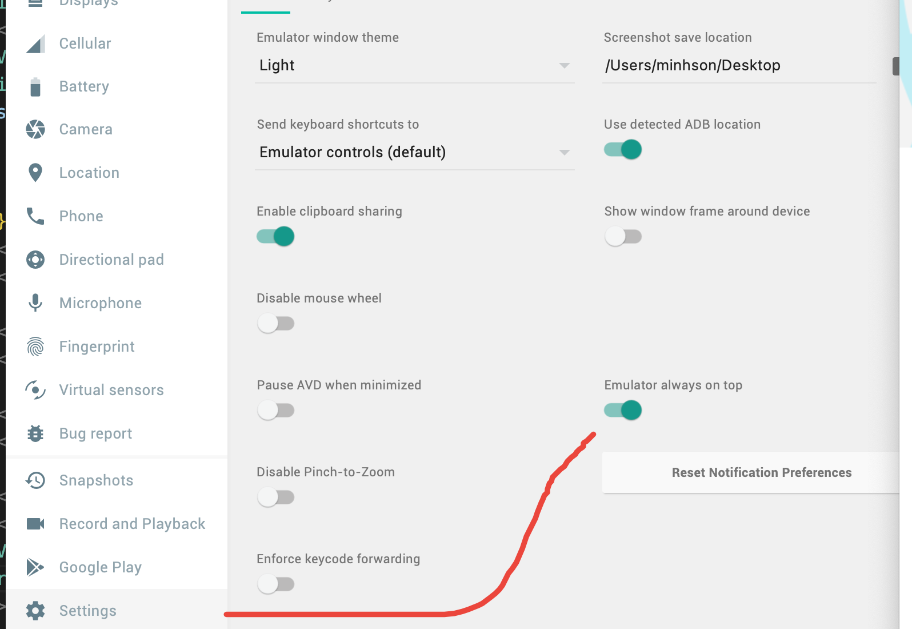

# Installation

## Prerequisites

**Android**

- ✓ Adb - Required to verify if the android device is attached correctly
- ✓ JDK - Required to compile Java code
- ✓ Android Studio - Required for building and installing your app on Android
- ✓ ANDROID_HOME - Environment variable that points to your Android SDK installation
- ✓ Gradlew - Build tool required for Android builds
- ✓ Android SDK - Required for building and installing your app on Android

## Android Environment setup

Prerequisites:

- ✓ Adb - No devices and/or emulators connected. Please create emulator with Android Studio or connect Android device.
- ✓ JDK - Required to compile Java code
- ✓ Android Studio - Required for building and installing your app on Android
- ✓ ANDROID_HOME - Environment variable that points to your Android SDK installat

```
export ANDROID_HOME=$HOME/Library/Android/sdk
export PATH=$PATH:$ANDROID_HOME/emulator
export PATH=$PATH:$ANDROID_HOME/platform-tools
```

Download link Tools and versions:

- [x] [Java SDK Manager](https://sdkman.io/)
- [x] JDK 17.x - 20.x
- [x] Android Studio
- [x] NDK: 27.1.12297006

### Working with adb and emulator

```sh
emulator -list-avds
emulator -avd android_15_small
adb devices
```

##### Keep Android Emulator Always on top of VSCode/Editor



## References

- [Android Environment setup](https://stackoverflow.com/questions/62797240/reactnative-cant-locate-android-sdk)
