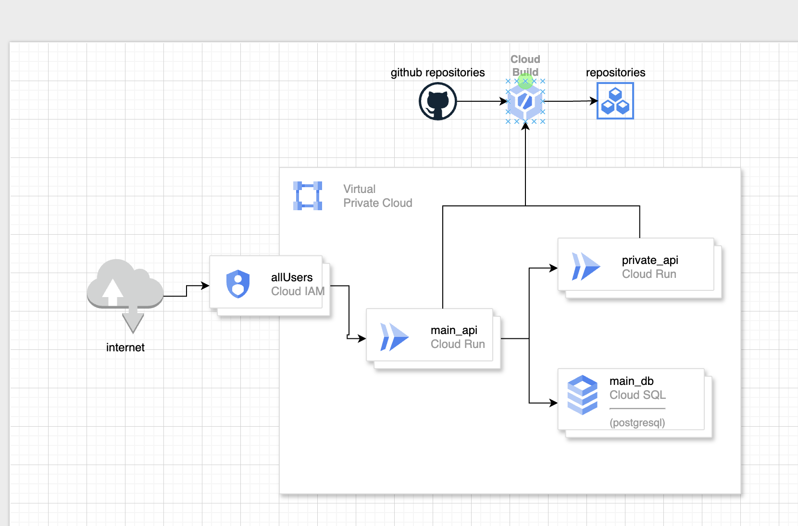

# Gcloud Network Basic

## Ingress vs Egress

### What is Egress in Cloud ?

In cloud-based systems, egress traffic involves data transmission from a controlled, internal network space—such as a data center or cloud infrastructure—to the wider internet. This movement requires careful handling, particularly through.

### What is Ingress in Cloud ?

In cloud environments, ingress involves unsolicited external traffic attempting to access the private network. This can include external data packets and requests that are not responses to internal actions. Firewalls are essential in these scenarios, configured to block or scrutinize incoming traffic unless specific security policies and configurations are in place to permit certain types of ingress. See the picture below for reference.

## GCP Egress Charges Summary Table

| Source → Destination                               | Egress Charged? | Notes                                                     |
| -------------------------------------------------- | --------------- | --------------------------------------------------------- |
| VM → VM (same zone, same VPC)                      | ❌ No           | Uses internal network                                     |
| VM → VM (different zone, same region, same VPC)    | ✅ Yes          | Inter-zone egress (about $0.01/GB)                        |
| VM → VM (different region, same VPC)               | ✅ Yes          | Cross-region egress (~$0.12/GB)                           |
| VM → Internet                                      | ✅ Yes          | Standard internet egress (~$0.12/GB)                      |
| VM → Cloud Storage (GCS, same region)              | ✅ Yes          | Even same region incurs egress (~$0.01/GB)                |
| VM → Cloud Storage (GCS, different region)         | ✅ Yes          | Cross-region egress                                       |
| VM → Firebase Storage                              | ✅ Yes          | Backed by GCS, same rules apply                           |
| VM → Filestore (same zone)                         | ❌ No           | Internal to zone, no egress                               |
| VM → Filestore (different zone)                    | ✅ Yes          | Inter-zone egress                                         |
| VM → Load Balancer (internal)                      | ❌ No           | If backend and client are in same region and VPC          |
| VM → Load Balancer (external)                      | ✅ Yes          | Charges apply if backend is accessed from external client |
| VM → Other VPC (same region) via VPC Peering       | ✅ Yes          | ~0.01/GB egress                                           |
| VM → Other VPC (different region) via VPC Peering  | ✅ Yes          | Higher cross-region egress rate                           |
| VM → Google API (e.g., Cloud Functions, AI API)    | ✅ Yes          | GFE counts as egress unless using Private Google Access   |
| VM → Cloud SQL (same region, same VPC, private IP) | ❌ No           | Internal IP connection                                    |
| VM → Cloud SQL (public IP or cross-region)         | ✅ Yes          | Public IP or cross-region counts as egress                |

## Practice

### Create and deploy 2 services below

1. Main Service : Public
2. Private Service : Private
3. CloudBuild will connect with github repositories and trigger build for both main(public) and private service

Main Service connects with:

- Private Service
- CloudSQL

User can access Main Service through IAM configuration ( allow all users )
